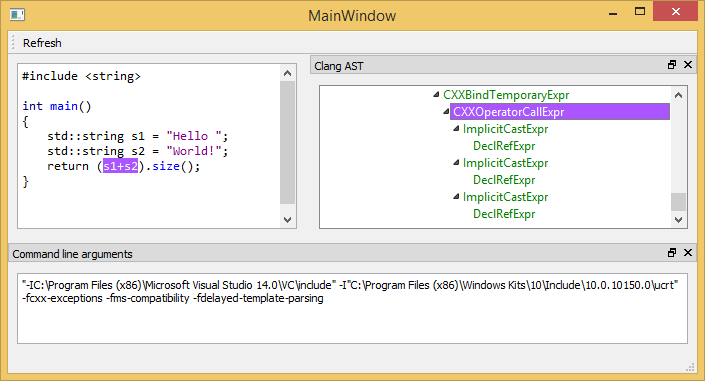

# Clang-ast-viewer
##Introduction
This program allows you to visualize an AST as it is generated by Clang when analyzing some source code.

Clang does a pretty decent work of displaying a static AST in text mode, but the goal of this program is to make it easier to navigate this AST. Currently, it provides three major benefits:

* When you move the cursor in the source code, the corresponding AST node is highlighted
* When you select a node in the AST, the corresponding source code is selected, allowing you to better understand the purpose of this node.
* When you select the node corresponding to a function, you can display the CFG of this function.

##Future work
This product is really in its early development stages. Future direction could include:

* Automatically generating some PCH file to improve parsing time 
* Dynamic update of the AST (instead of clicking refresh) 
* Filtering the AST to remove nodes that come from #included files.
* Add more information to the nodes (value, type information, resolved symbol for functions...), in the property grid.
* Simplify the build system (now, some paths have to be changed in the `CMakeLists.txt` file)

Feel free to help us with the implementation of those, of of other ideas.

##Version histoy

* Increase stability
* Disable the AST tree when it's no longer in sync with the source code
* Add CFG display

##License
This product is provided under LGPL. See the `LICENCE` file for more information.